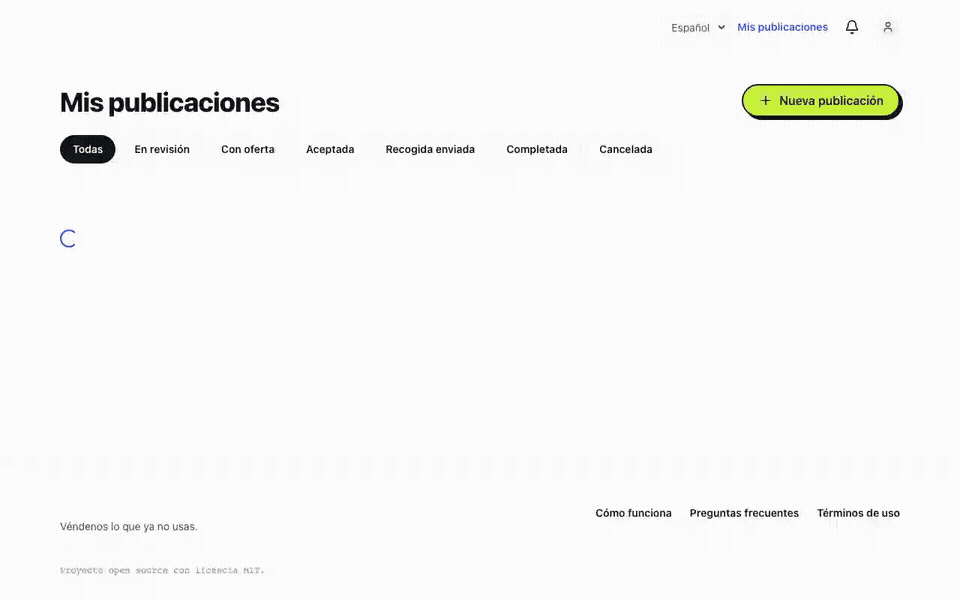
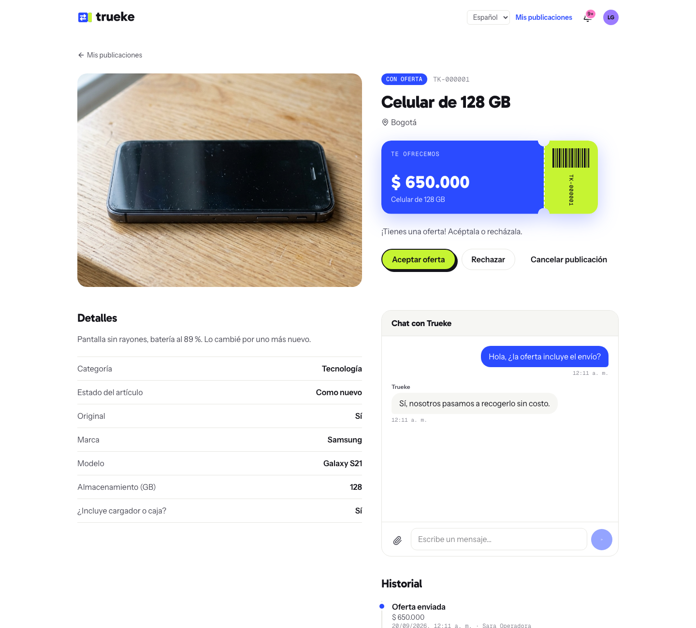
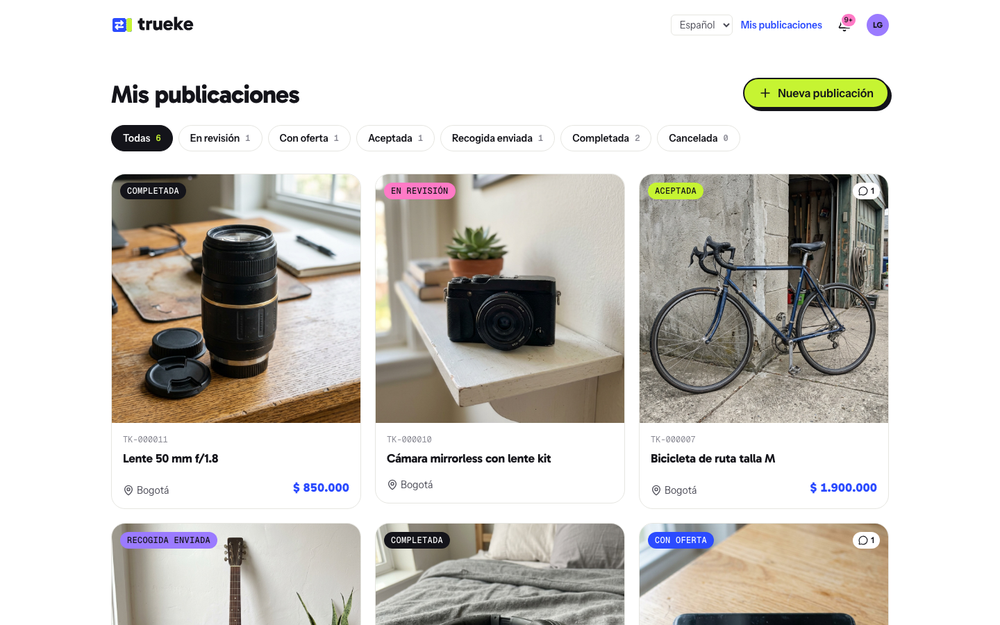
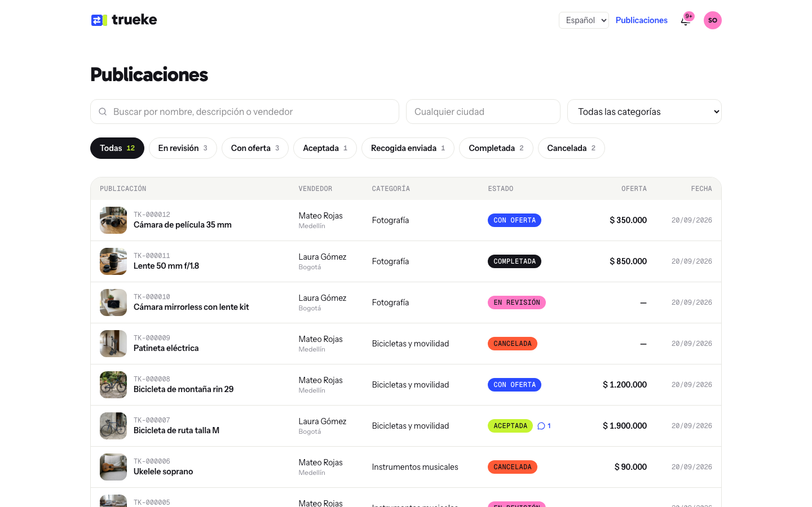

<p align="center"></p>

<p align="center"><strong>Véndenos lo que ya no usas.</strong><br>Marketplace open source en el que la plataforma compra artículos usados.</p>

<p align="center"></p>

**Trueke** funciona así:
1. La persona publica su artículo con fotos y los datos de su categoría.
2. El equipo de la plataforma lo revisa y le hace una oferta.
3. Si la acepta, se coordina la recogida y se le paga.

Todo pasa en tiempo real: ofertas, cambios de estado, chat y notificaciones.

## Qué incluye

- **Login sin contraseñas**, por teléfono y código de un solo uso (SMS con Twilio; en desarrollo, en los logs).
- **Publicaciones con campos por categoría**: cada categoría define los suyos con un JSON Schema desde el admin.
- **Máquina de estados** (en revisión → con oferta → aceptada → recogida → completada, o cancelada), con permisos por acción y el historial completo.
- **Chat en vivo** por publicación, con adjuntos privados y leídos.
- **Notificaciones en vivo** (campana y avisos) por un único WebSocket autenticado.
- **Panel del operador**: búsqueda, filtros, ficha del vendedor con sus documentos, ofertas y recogidas.
- **Documentos privados**: identidad y certificado bancario, sin URL pública (en S3, URLs firmadas).
- **Español e inglés** en la app y en la API.

| | |
|---|---|
|  |  |
|  |  |

## Empezar

Con Docker:

```sh
make dev     # app en http://localhost:5173 · API en http://localhost:8000/api/docs/
make seed    # datos de demo (en otra terminal)
```

Entra con `300 000 0002` (vendedora) o `300 000 0001` (operadora). El código aparece en `docker compose logs backend worker | grep OTP`. Más opciones, también sin Docker, en [`docs/instalacion.md`](docs/instalacion.md).

## Documentación

- [Instalación](docs/instalacion.md): Docker, sin Docker, cuentas de demo y comandos
- [Arquitectura](docs/arquitectura.md): apps, máquina de estados, tiempo real, archivos, frontend
- [API](docs/api.md): autenticación, errores, endpoints y protocolo del WebSocket (referencia completa en `/api/docs/`)
- [Despliegue](docs/despliegue.md): variables, S3, nginx y la lista para abrir al público
- [Cómo contribuir](CONTRIBUTING.md)
- [Marca](brand/README.md): logo, color, tipografía e imágenes

## Stack

- **Backend**: Python 3.12, Django 5, Django REST Framework, Channels, Celery, PostgreSQL, Redis.
- **Frontend**: React 19 con React Compiler, Vite, TypeScript, Tailwind CSS 4, TanStack Query y Router, Zustand, React Hook Form + Zod, i18next.
- **Calidad**: pytest, Vitest, Playwright (pruebas de extremo a extremo), ruff, oxlint, oxfmt y GitHub Actions.

## Licencia

[MIT](LICENSE)
