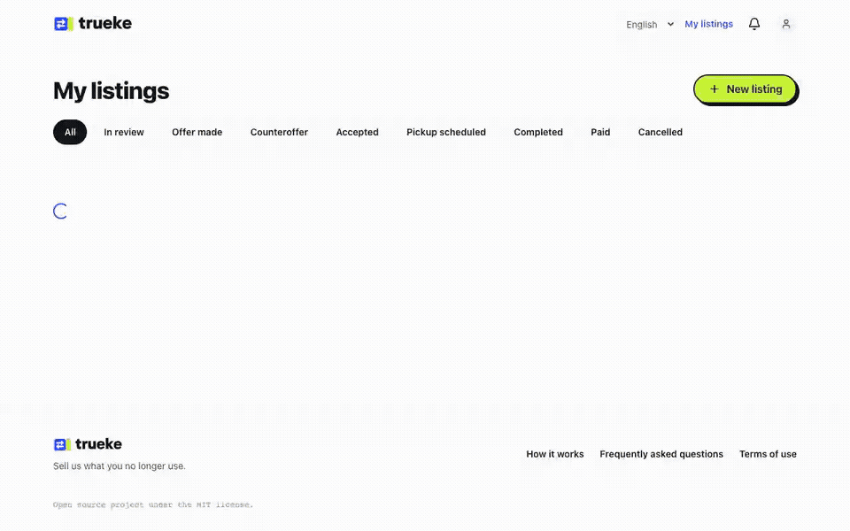
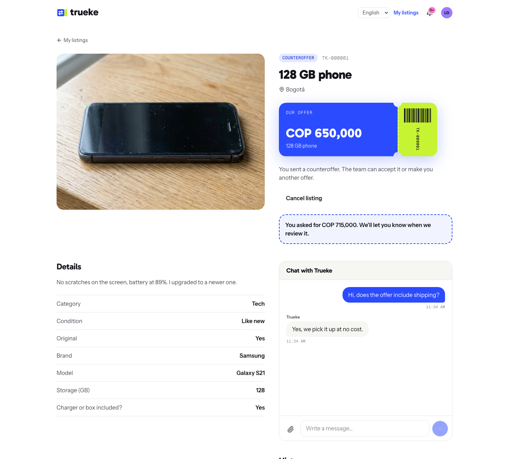
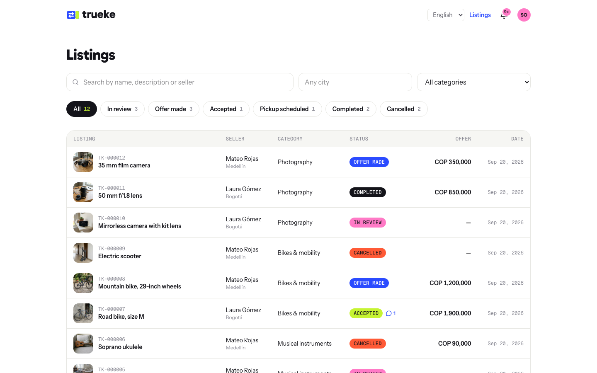

<p align="center"></p>

<p align="center"><strong>English</strong> · <a href="README.es.md">Español</a></p>

<p align="center"><strong>Sell us what you no longer use.</strong><br>An open source marketplace where the platform buys used items.</p>

<p align="center"></p>

**Trueke** works like this:
1. A person lists an item with photos and the details of its category.
2. The platform team reviews it and makes an offer.
3. If the person accepts, the team picks it up and pays them.

Everything happens in real time: offers, status changes, chat and notifications.

## What it includes

- **Login without passwords**: phone number and a one-time code (SMS with Twilio; in development, the code is in the logs).
- **Listings with fields per category**: each category defines its own fields with a JSON Schema in the admin.
- **A state machine**: in review → offer made (the seller can make a counteroffer) → accepted → pickup → completed → paid (or cancelled). Every action has permissions and a full history.
- **Live chat** for each listing, with private attachments and read receipts.
- **Live notifications** (bell and pop-up messages) through one authenticated WebSocket.
- **Operator panel**: search, filters, the seller's profile and documents, offers and pickups.
- **Private documents**: ID and bank certificate have no public URL (signed URLs on S3).
- **English and Spanish** in the app and the API. English is the default; the app uses Spanish when the browser or the person asks for it.

| | |
|---|---|
|  |  |
|  |  |

## Get started

With Docker:

```sh
make dev     # app at http://localhost:5173 · API at http://localhost:8000/api/docs/
make seed    # demo data (in another terminal)
```

Log in with `300 000 0002` (seller) or `300 000 0001` (operator). The code is in `docker compose logs backend worker | grep OTP`. There are more options, also without Docker, in [`docs/installation.md`](docs/installation.md).

## Documentation

- [Installation](docs/installation.md): Docker, without Docker, demo accounts and commands
- [Architecture](docs/architecture.md): apps, state machine, real time, files, frontend
- [API](docs/api.md): login, errors, endpoints and the WebSocket protocol (full reference at `/api/docs/`)
- [Deployment](docs/deployment.md): settings, S3, nginx and a checklist before going live
- [Contributing](CONTRIBUTING.md)
- [Changelog](CHANGELOG.md)
- [Brand](brand/README.md): logo, colors, fonts and images

## Stack

- **Backend**: Python 3.12, Django 5, Django REST Framework, Channels, Celery, PostgreSQL, Redis.
- **Frontend**: React 19 with React Compiler, Vite, TypeScript, Tailwind CSS 4, TanStack Query and Router, Zustand, React Hook Form + Zod, i18next.
- **Quality**: pytest, Vitest, Playwright (end-to-end tests), ruff, oxlint, oxfmt and GitHub Actions.

## License

[MIT](LICENSE)
