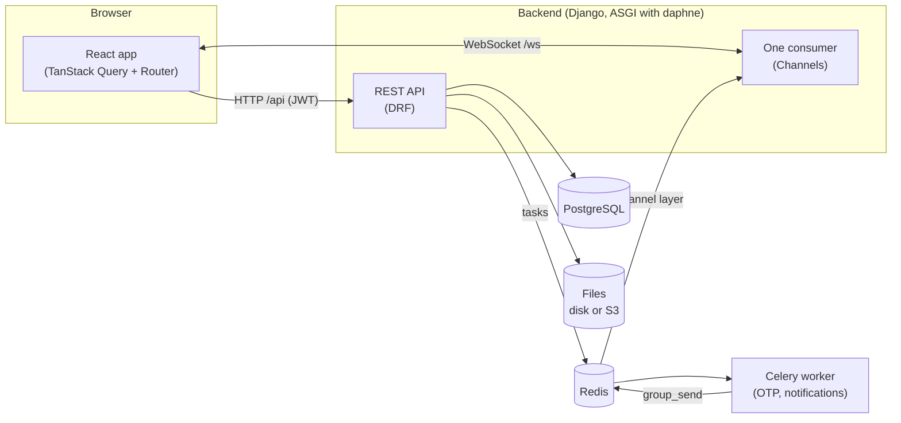
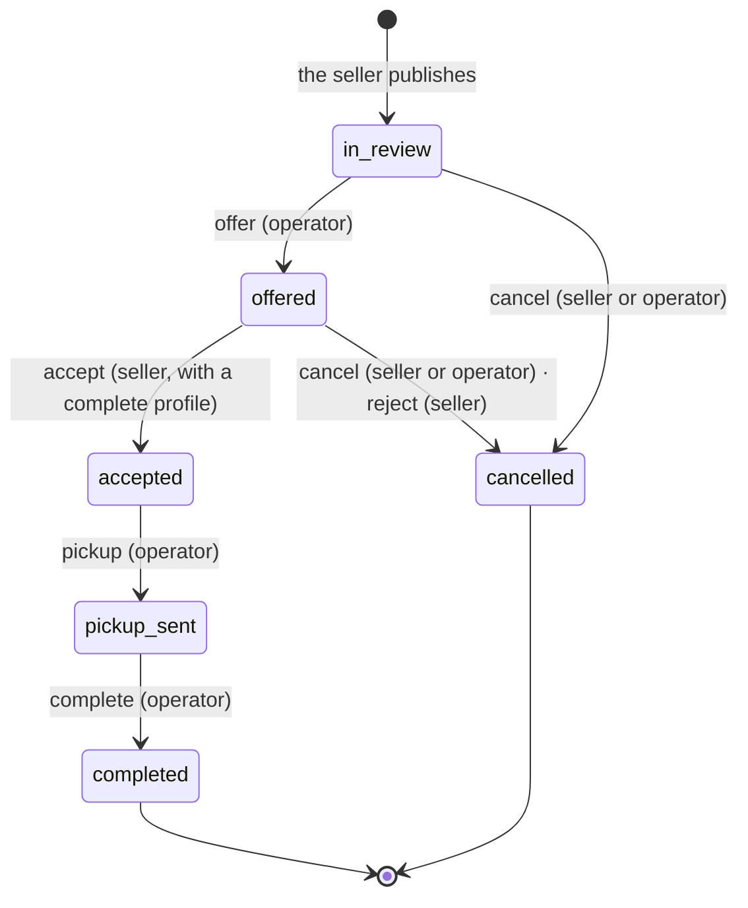

<p><strong>English</strong> · <a href="es/arquitectura.md">Español</a></p>

# Architecture



## Backend

The backend uses Django 5 with Django REST Framework, Channels for the WebSocket and Celery for background tasks. There is one app per area in `backend/apps/`:

| App | What it does |
|---|---|
| `accounts` | Users who log in with a one-time code (no passwords), JWT, profile and private documents. OTP providers: `console`, `twilio`, `outbox` (end-to-end tests only). |
| `listings` | Categories with extra fields in JSON Schema, listings, photos and the state machine. |
| `chat` | One chat per listing between the seller and the platform, with private attachments and read receipts. |
| `notifications` | Messages for "the other side" of each action. Celery creates them and they are sent live. |
| `realtime` | The single WebSocket and `broadcast(channel, event, data)`. |
| `newsletter` | Public sign-up and unsubscribe with a token. |

### State machine

Every status change of a listing goes through `apps/listings/transitions.py`. It is the only place that changes `Listing.status`.



Each transition:

1. Locks the row (`select_for_update`), so two requests at the same time can't start from the same status.
2. Checks who asks and the current status. If the action is not allowed, it returns `403 not_allowed` or `409 invalid_state`.
3. Saves a `ListingEvent` for the history.
4. After the database transaction commits, sends the `listing_transitioned` signal. The live update (`realtime`) and the notifications (`notifications`) start from there.

The API returns `available_actions` in each listing: the transitions the current user can do. The frontend shows the buttons from that list and doesn't repeat the rules.

### Real time

There is one WebSocket at `/ws/`. The JWT goes in the **first message**, not in the URL, so it doesn't end up in proxy logs. The full protocol is in [`api.md`](api.md#websocket). There are two kinds of channel:

- `user.<id>`: the person's notifications. Each connection joins its own channel automatically.
- `listing.<id>`: status changes and messages of a listing. Only people who can see the listing can join.

`broadcast()` sends the event after the database commit (`transaction.on_commit`), so nobody gets an event for a change that was rolled back.

### Files

| What | Where | Access |
|---|---|---|
| Listing and profile photos | public storage (disk or S3) | direct URL |
| ID document, bank certificate, chat attachments | **private** storage | only through the API, with permissions. On disk the view sends the file; on S3 it redirects to a signed URL that expires in 5 minutes. |

File names are replaced with random ones, because the original name can include personal data.

## Frontend

React 19 with the React Compiler, Vite and strict TypeScript. The state rules come from the problems of the previous project:

- **Server data lives only in TanStack Query.** It is never copied into `useState` with an effect. Forms use React Hook Form's `values` to follow the server data.
- **Client state lives in Zustand, and there is little of it**: the session tokens and the pop-up messages.
- **The WebSocket lives outside React** (`src/realtime/client.ts`). Its events don't put data into the UI. They only invalidate the affected queries (`src/realtime/events.ts`), and TanStack Query fetches again what is on screen.
- **Lint rules for hooks and the compiler are errors** (oxlint): `exhaustive-deps`, `no-deriving-state-in-effects`, `set-state-in-effect`…
- **A render count test** (`src/test/renders.test.tsx`): key pages must stay still after they load.

```
frontend/src/
  api/          openapi-fetch client with generated types (schema.d.ts) and token refresh
  auth/         session (Zustand) and current user
  components/   design system (ui/) and shared pieces
  features/     one folder per area: listings, chat, notifications, account, landing…
  i18n/         English and Spanish, with typed keys
  realtime/     WebSocket client, provider and query keys
  routes/       file-based routes (TanStack Router); private routes are under _app/
```

`make api` generates the API types from the backend's OpenAPI schema. CI fails if they are out of date, so a backend change that breaks the frontend can't be merged.

### Languages

English is the default language in the app and in the API. Spanish is the second language:

- **Frontend**: `src/i18n/locales/en.json` and `es.json`. The app uses the browser language when it is Spanish; otherwise it uses English. After login, the profile language is used.
- **Backend**: the source strings are in Spanish. `backend/locale/en` has the English translations. `backend/locale/es` repeats the Spanish strings, because without it Django would fall back to English. `make messages` keeps both catalogs up to date.

## Tests

| Layer | Tool | Where |
|---|---|---|
| Backend | pytest + factory_boy | `backend/apps/*/tests/`. It includes the full permission matrix for each transition and, in CI, the WebSocket against a real Redis. |
| Frontend | Vitest + Testing Library | `frontend/src/**/*.test.ts(x)`. The API is mocked with `mockApi` (`src/test/api.ts`). |
| End to end | Playwright | `frontend/e2e/`: a full sale between two people in two browsers, against the real backend. |
