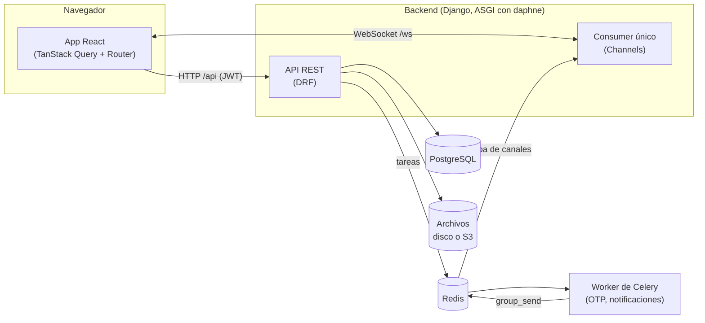
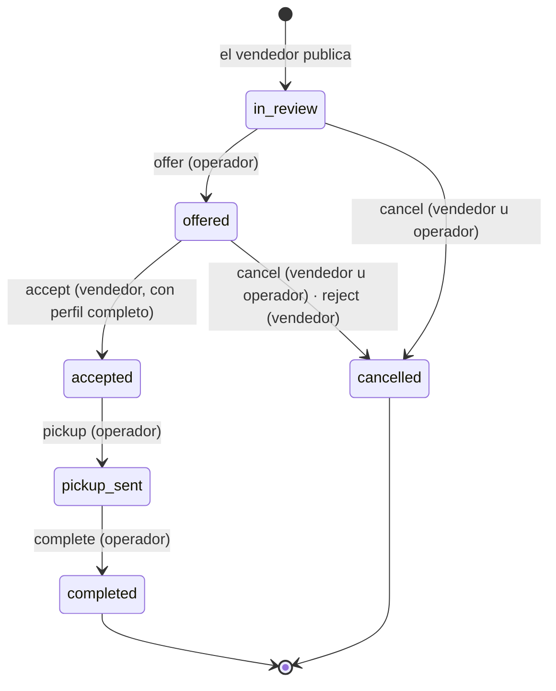

<p><a href="../architecture.md">English</a> · <strong>Español</strong></p>

# Arquitectura



## Backend

Django 5 con Django REST Framework, Channels para el WebSocket y Celery para las tareas. Una app por dominio en `backend/apps/`:

| App | Qué hace |
|---|---|
| `accounts` | Usuario con login por OTP (sin contraseñas), JWT, perfil y documentos privados. Proveedores de OTP: `console`, `twilio`, `outbox` (solo E2E). |
| `listings` | Categorías con campos extra en JSON Schema, publicaciones, fotos y la máquina de estados. |
| `chat` | Un chat por publicación entre el vendedor y la plataforma, con adjuntos privados y leídos. |
| `notifications` | Avisos para "el otro lado" de cada acción; se generan en Celery y se envían en vivo. |
| `realtime` | El WebSocket único y `broadcast(canal, evento, datos)`. |
| `newsletter` | Alta pública y baja por token. |

### Máquina de estados

Todo cambio de estado de una publicación pasa por `apps/listings/transitions.py`: es el único sitio que toca `Listing.status`.



Cada transición:

1. Bloquea la fila (`select_for_update`), así dos peticiones simultáneas no pueden partir del mismo estado.
2. Comprueba quién la pide y desde qué estado. Si no toca, devuelve `403 not_allowed` o `409 invalid_state`.
3. Guarda un `ListingEvent` con el historial.
4. Cuando la transacción se confirma, emite la señal `listing_transitioned`. De ahí salen el aviso en vivo (`realtime`) y las notificaciones (`notifications`).

La API devuelve en cada publicación `available_actions`, las transiciones que puede hacer quien pregunta. El frontend pinta los botones con eso y no repite las reglas.

### Tiempo real

Un solo WebSocket en `/ws/`, autenticado con el JWT en el **primer mensaje**, no en la URL, para que no quede en los logs de los proxies. El protocolo completo está en [`api.md`](api.md#websocket). Hay dos tipos de canal:

- `user.<id>`: notificaciones de la persona. Cada conexión se suscribe sola al suyo.
- `listing.<id>`: cambios de estado y mensajes de una publicación. Solo puede suscribirse quien puede ver la publicación.

`broadcast()` envía después del commit de la base de datos (`transaction.on_commit`), así nadie recibe un evento de algo que luego se deshizo.

### Archivos

| Qué | Dónde | Acceso |
|---|---|---|
| Fotos de publicaciones y de perfil | almacenamiento público (disco o S3) | URL directa |
| Documento de identidad, certificado bancario, adjuntos del chat | almacenamiento **privado** | solo por la API, con permisos. En disco se sirven por la vista; en S3, con URL firmada de 5 minutos. |

Los nombres de archivo se reemplazan por uno aleatorio: el nombre original puede tener datos personales.

## Frontend

React 19 con el React Compiler, Vite y TypeScript estricto. Las reglas de estado se tomaron de los problemas del proyecto anterior:

- **Datos del servidor, solo en TanStack Query.** Nada de copiarlos a `useState` con un efecto. Los formularios usan `values` de React Hook Form para seguir a los datos.
- **Estado de cliente, en Zustand, y poco**: los tokens de sesión y los avisos emergentes.
- **El WebSocket vive fuera de React** (`src/realtime/client.ts`). Sus eventos no traen datos a la interfaz: solo invalidan las queries afectadas (`src/realtime/events.ts`) y TanStack Query vuelve a pedir lo que esté en pantalla.
- **Lint de hooks y del compilador como error** (oxlint): `exhaustive-deps`, `no-deriving-state-in-effects`, `set-state-in-effect`…
- **Test de conteo de renders** (`src/test/renders.test.tsx`): las páginas clave deben quedar quietas tras cargar.

```
frontend/src/
  api/          cliente openapi-fetch con tipos generados (schema.d.ts) y renovación del token
  auth/         sesión (Zustand) y usuario actual
  components/   sistema de diseño (ui/) y piezas compartidas
  features/     por dominio: listings, chat, notifications, account, landing…
  i18n/         español e inglés, con claves tipadas
  realtime/     cliente del WebSocket, provider y claves de las queries
  routes/       rutas por archivos (TanStack Router); las privadas cuelgan de _app/
```

Los tipos de la API se generan con `make api` desde el esquema OpenAPI del backend. El CI falla si no están al día, así que un cambio en el backend que rompa el frontend no pasa.

### Idiomas

El inglés es el idioma por defecto en la app y en la API; el español es el segundo:

- **Frontend**: `src/i18n/locales/en.json` y `es.json`. La app usa el idioma del navegador si es español; si no, inglés. Al entrar se aplica el idioma del perfil.
- **Backend**: los textos fuente están en español. `backend/locale/en` tiene las traducciones al inglés. `backend/locale/es` repite los textos en español, porque sin él Django usaría el inglés como respaldo. `make messages` mantiene los dos catálogos al día.

## Pruebas

| Capa | Herramienta | Dónde |
|---|---|---|
| Backend | pytest + factory_boy | `backend/apps/*/tests/`. Incluye la matriz completa de permisos por transición y el WebSocket contra un Redis real en CI. |
| Frontend | Vitest + Testing Library | `frontend/src/**/*.test.ts(x)`. La API se simula con `mockApi` (`src/test/api.ts`). |
| Extremo a extremo | Playwright | `frontend/e2e/`: venta completa entre dos personas en dos navegadores, contra el backend real. |
